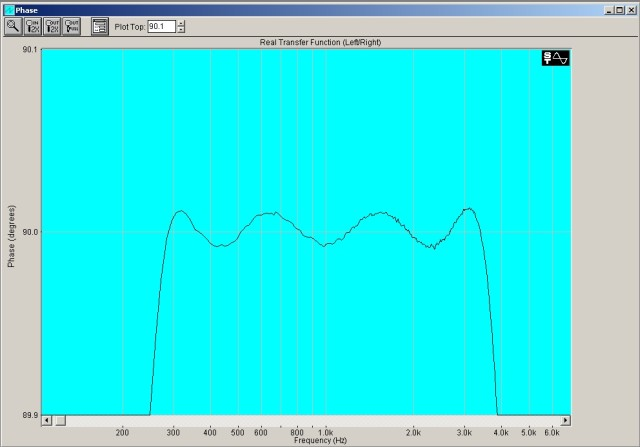
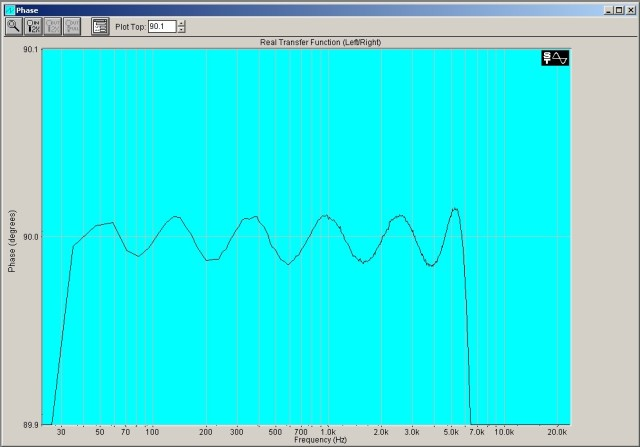
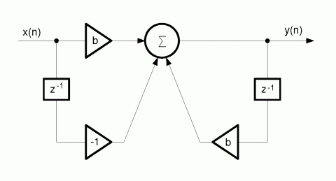

# Analog phase shifter design results

``` 
Desired phase = 90 deg.
Number of sections in each leg = 4
Starting frequency = 270 Hz
Ending frequency = 3600 Hz
p-norm for optimization: 2
 
The 90 degree frequencies for each section are:
Leg 1, Phase shifter 1:  f0 =     224.35 Hz
Leg 1, Phase shifter 2:  f0 =     756.79 Hz
Leg 1, Phase shifter 3:  f0 =    2232.81 Hz
Leg 1, Phase shifter 4:  f0 =   14070.11 Hz
 
Leg 2, Phase shifter 1:  f0 =      69.08 Hz
Leg 2, Phase shifter 2:  f0 =     435.33 Hz
Leg 2, Phase shifter 3:  f0 =    1284.38 Hz
Leg 2, Phase shifter 4:  f0 =    4332.57 Hz
```


```
Desired phase = 90 deg.
Number of sections in each leg = 7
Starting frequency = 20 Hz
Ending frequency = 6300 Hz
p-norm for optimization: 2
 
The 90 degree frequencies for each section are:
Leg 1, Phase shifter 1:  f0 =      17.35 Hz
Leg 1, Phase shifter 2:  f0 =      59.31 Hz
Leg 1, Phase shifter 3:  f0 =     166.52 Hz
Leg 1, Phase shifter 4:  f0 =     456.83 Hz
Leg 1, Phase shifter 5:  f0 =    1260.53 Hz
Leg 1, Phase shifter 6:  f0 =    3716.67 Hz
Leg 1, Phase shifter 7:  f0 =   23720.76 Hz
 
Leg 2, Phase shifter 1:  f0 =       5.31 Hz
Leg 2, Phase shifter 2:  f0 =      33.92 Hz
Leg 2, Phase shifter 3:  f0 =     100.02 Hz
Leg 2, Phase shifter 4:  f0 =     275.96 Hz
Leg 2, Phase shifter 5:  f0 =     757.11 Hz
Leg 2, Phase shifter 6:  f0 =    2125.82 Hz
Leg 2, Phase shifter 7:  f0 =    7267.87 Hz
```


## Allpass filter structure:



